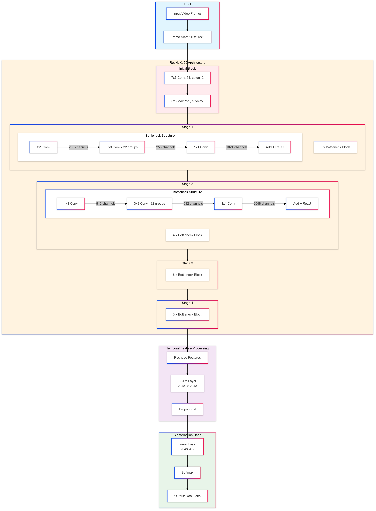

# DEEPFAKE-DETECTION
This project involves the use of a prominent Convolutional Neural Network i.e., ResNeXt model series and an LSTM to utilise the detection of spatial and temporal inconsistencies to achieve singlular modularity deepfake detection of videos.

The project's interface uses a simple Streamlit app, just upload a video and call it a day.

## About the Model
The architecture is something like this, where the last two layers of ResNeXt model are stripped off such that we can have access to the feature maps generated for the entire video(generated frame by frame), which will be used to provide our LSTM with sequential data. We then use the softmax function to get logit values for our predictions, determining whether the video is fake or real!



## Usage
Just upload any file and let the code do its work!


## Guidelines
To setup the project to run on your system, use [Poetry](https://python-poetry.org/docs/) to install the required libraries. 
```
poetry install
poetry shell (to switch to virtual environment's interpreter)
```
To run the streamlit app, follow the below steps(after switching to virtual env)
```
cd deepfake_detection
streamlit run app.py
```